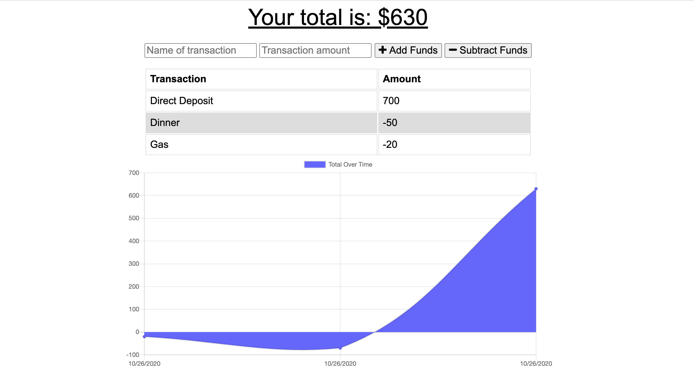

# Budget-Tracker

Hello! Welcome to my Budget Tracking application! Users can add expenses and deposits to their budgets to keep track of spending habits. This app is particularly useful for users that need to keep track of their expenses but don't have a constant data/internet connection. 
The application can fully function offline and when it is brought back online, the offline entries are made to the tracker. 

## Usage 
In order to use this application, simply visit the deployed application at https://joa-budget-tracker.herokuapp.com/. 

As you add transactions to the tracker, they will appear on the graph as shown below. 

## Installation
You do not need to install anything to use the application online, however if you would like to manipulate the code on your local machine, clone this repo, run npm i to install dependencies, and run npm server.js to view the application locally. 

## License
MIT 

## Contributing
If interested in contributing, please reach out to me directly via an email at jada.arnett@gmail.com. 
 
## Questions 
If you have any questions, please contact me directly at jada.arnett@gmail.com. 

